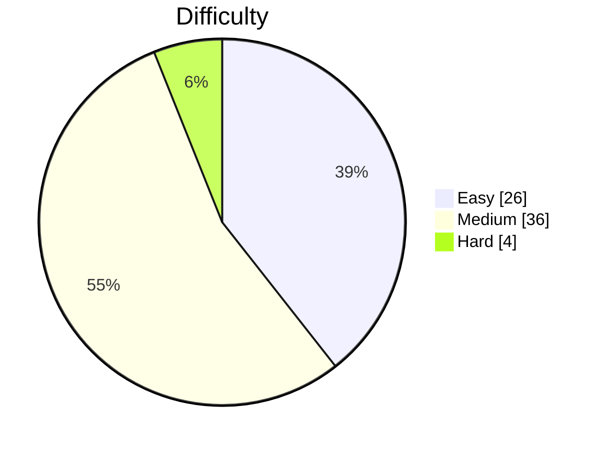

# LeetCode Solutions

LeetCode 풀이 모음입니다. [leetcode2remote](https://github.com/kevstevie/leetcode2remote) CLI로 자동 관리됩니다.

<!-- LEETCODE-STATS:START -->

## 📊 풀이 통계

**총 풀이: 66문제** · Easy 26 · Medium 36 · Hard 4

### 난이도별 분포

### 토픽별 분포 (Top 10)

| # | 토픽 | 풀이 수 | 분포 |
| ---: | --- | ---: | :--- |
| 1 | Array | 27 | ████████████████████████ |
| 2 | String | 10 | █████████ |
| 3 | Sorting | 9 | ████████ |
| 4 | Math | 8 | ███████ |
| 5 | Hash Table | 6 | █████ |
| 6 | Two Pointers | 5 | ████ |
| 7 | Greedy | 5 | ████ |
| 8 | Matrix | 4 | ████ |
| 9 | Dynamic Programming | 4 | ████ |
| 10 | Simulation | 3 | ███ |

<!-- LEETCODE-STATS:END -->
