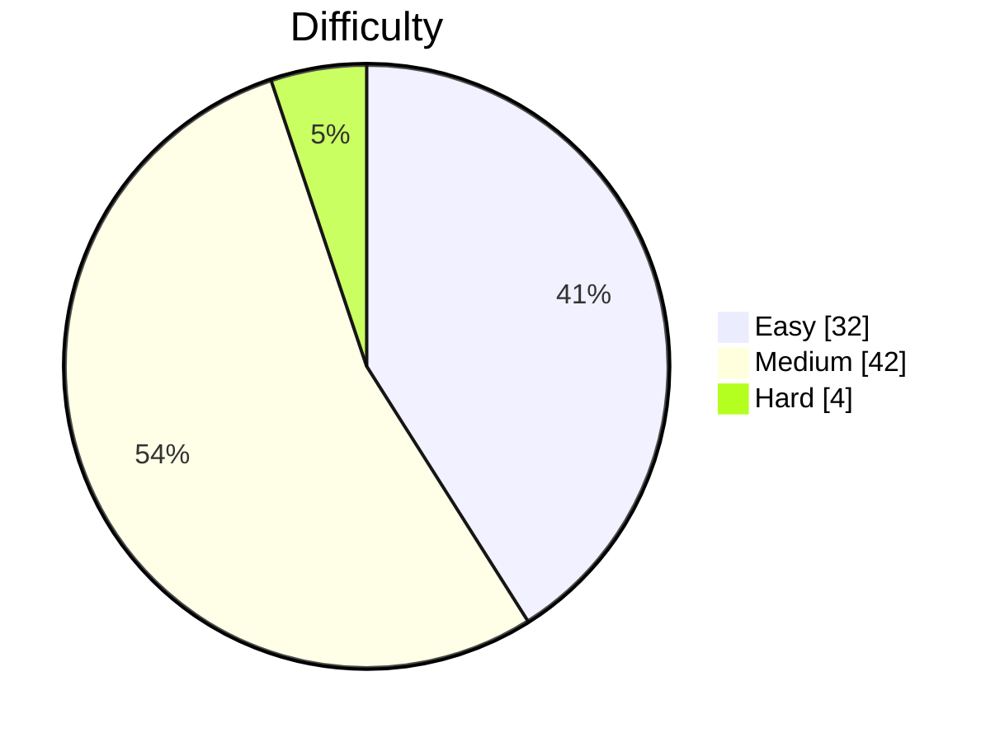

# LeetCode Solutions

LeetCode 풀이 모음입니다. [leetcode2remote](https://github.com/kevstevie/leetcode2remote) CLI로 자동 관리됩니다.

<!-- LEETCODE-STATS:START -->

## 📊 풀이 통계

**총 풀이: 78문제** · Easy 32 · Medium 42 · Hard 4

### 난이도별 분포

### 토픽별 분포 (Top 10)

| # | 토픽 | 풀이 수 | 분포 |
| ---: | --- | ---: | :--- |
| 1 | Array | 34 | ████████████████████████ |
| 2 | String | 15 | ███████████ |
| 3 | Sorting | 11 | ████████ |
| 4 | Hash Table | 10 | ███████ |
| 5 | Math | 9 | ██████ |
| 6 | Two Pointers | 6 | ████ |
| 7 | Greedy | 6 | ████ |
| 8 | Simulation | 5 | ████ |
| 9 | Matrix | 4 | ███ |
| 10 | Dynamic Programming | 4 | ███ |

<!-- LEETCODE-STATS:END -->
