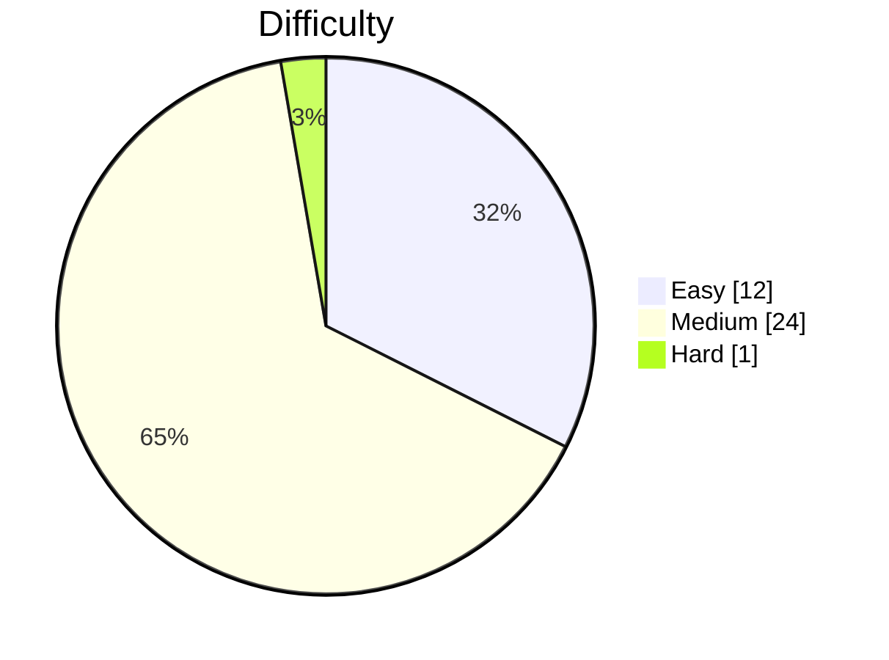
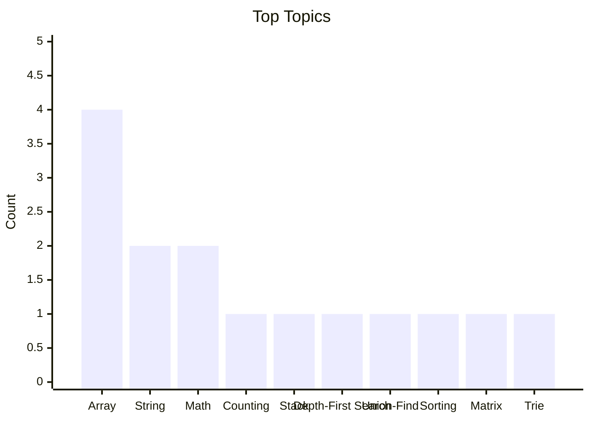

# LeetCode Solutions

LeetCode 풀이 모음입니다. [leetcode-commit](https://github.com/kevstevie/leetcode-commit) CLI로 자동 관리됩니다.

<!-- LEETCODE-STATS:START -->

## 📊 풀이 통계

**총 풀이: 37문제** · Easy 12 · Medium 24 · Hard 1

### 난이도별 분포

### 토픽별 분포 (Top 10)

<!-- LEETCODE-STATS:END -->
