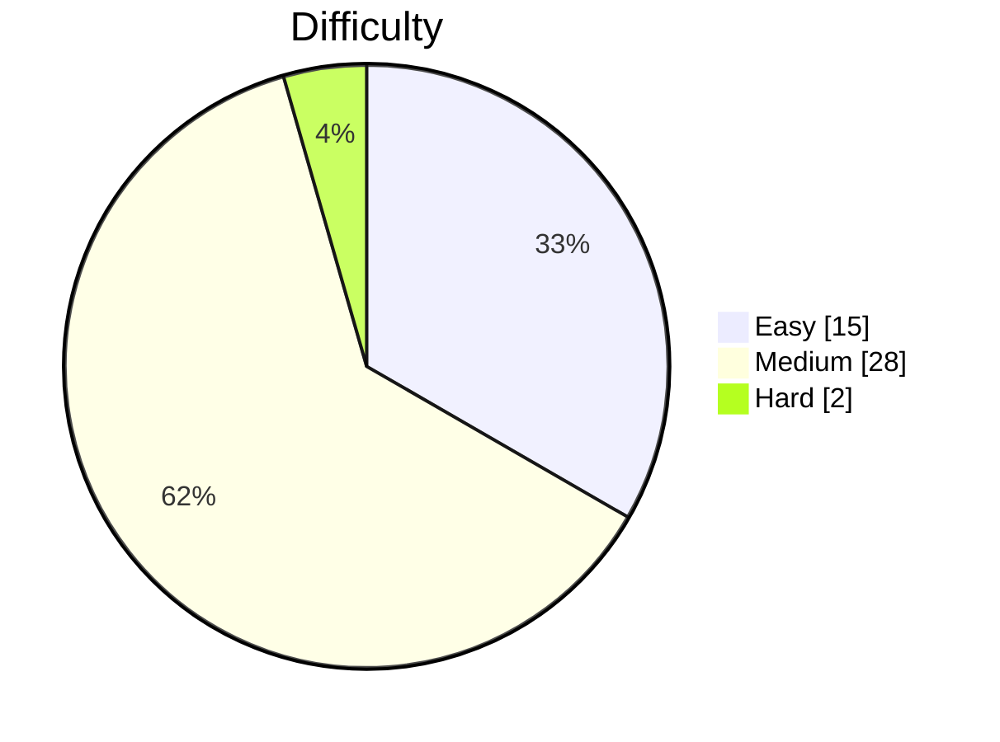

# LeetCode Solutions

LeetCode 풀이 모음입니다. [leetcode2remote](https://github.com/kevstevie/leetcode2remote) CLI로 자동 관리됩니다.

<!-- LEETCODE-STATS:START -->

## 📊 풀이 통계

**총 풀이: 45문제** · Easy 15 · Medium 28 · Hard 2

### 난이도별 분포

### 토픽별 분포 (Top 10)

| # | 토픽 | 풀이 수 | 분포 |
| ---: | --- | ---: | :--- |
| 1 | Array | 8 | ████████████████████████ |
| 2 | String | 6 | ██████████████████ |
| 3 | Math | 6 | ██████████████████ |
| 4 | Sorting | 3 | █████████ |
| 5 | Matrix | 3 | █████████ |
| 6 | Stack | 2 | ██████ |
| 7 | String Matching | 1 | ███ |
| 8 | Hash Table | 1 | ███ |
| 9 | Counting | 1 | ███ |
| 10 | Simulation | 1 | ███ |

<!-- LEETCODE-STATS:END -->
