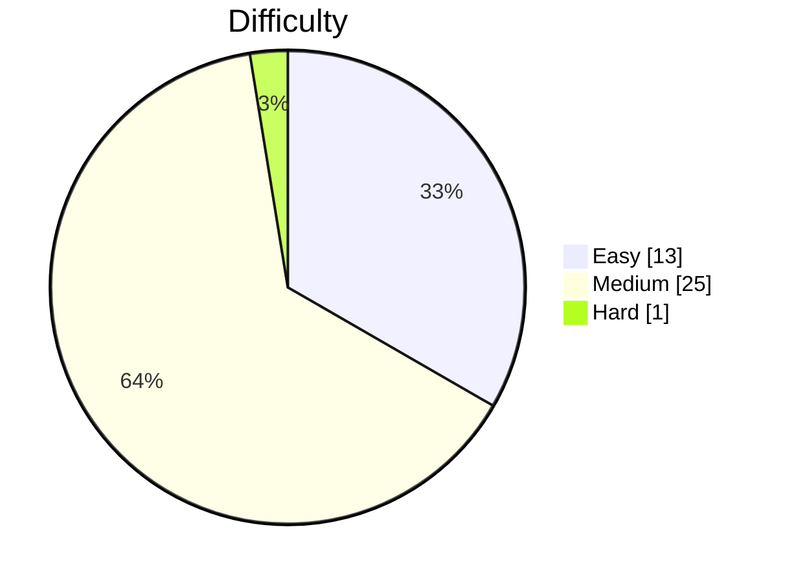

# LeetCode Solutions

LeetCode 풀이 모음입니다. [leetcode-commit](https://github.com/kevstevie/leetcode-commit) CLI로 자동 관리됩니다.

<!-- LEETCODE-STATS:START -->

## 📊 풀이 통계

**총 풀이: 39문제** · Easy 13 · Medium 25 · Hard 1

### 난이도별 분포

### 토픽별 분포 (Top 10)

| # | 토픽 | 풀이 수 | 분포 |
| ---: | --- | ---: | :--- |
| 1 | Array | 5 | ████████████████████████ |
| 2 | Math | 3 | ██████████████ |
| 3 | String | 2 | ██████████ |
| 4 | Matrix | 2 | ██████████ |
| 5 | Counting | 1 | █████ |
| 6 | Simulation | 1 | █████ |
| 7 | Stack | 1 | █████ |
| 8 | Depth-First Search | 1 | █████ |
| 9 | Union-Find | 1 | █████ |
| 10 | Sorting | 1 | █████ |

<!-- LEETCODE-STATS:END -->
