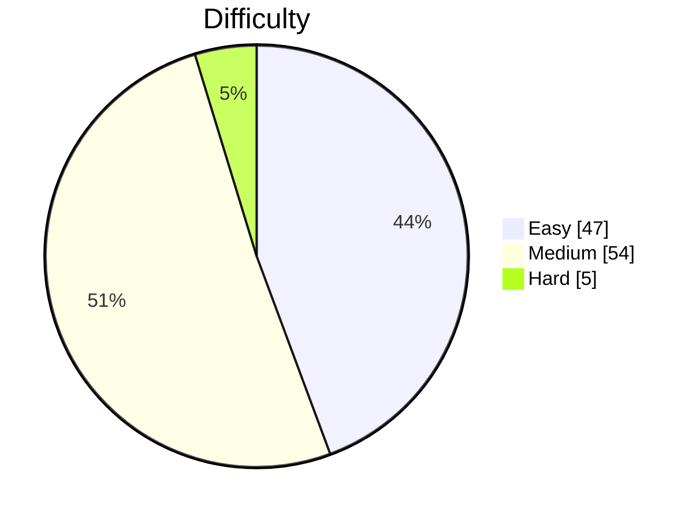

# LeetCode Solutions

LeetCode 풀이 모음입니다. [leetcode2remote](https://github.com/kevstevie/leetcode2remote) CLI로 자동 관리됩니다.

<!-- LEETCODE-STATS:START -->

## 📊 풀이 통계

**총 풀이: 106문제** · Easy 47 · Medium 54 · Hard 5

### 난이도별 분포

```mermaid
pie showData
    title Difficulty
    "Easy"   : 47
    "Medium" : 54
    "Hard"   : 5
```

### 토픽별 분포 (Top 10)

| # | 토픽 | 풀이 수 | 분포 |
| ---: | --- | ---: | :--- |
| 1 | Array | 48 | ████████████████████████ |
| 2 | String | 22 | ███████████ |
| 3 | Math | 20 | ██████████ |
| 4 | Sorting | 20 | ██████████ |
| 5 | Hash Table | 15 | ████████ |
| 6 | Two Pointers | 8 | ████ |
| 7 | Matrix | 7 | ████ |
| 8 | Simulation | 7 | ████ |
| 9 | Greedy | 7 | ████ |
| 10 | Dynamic Programming | 5 | ███ |

<!-- LEETCODE-STATS:END -->
