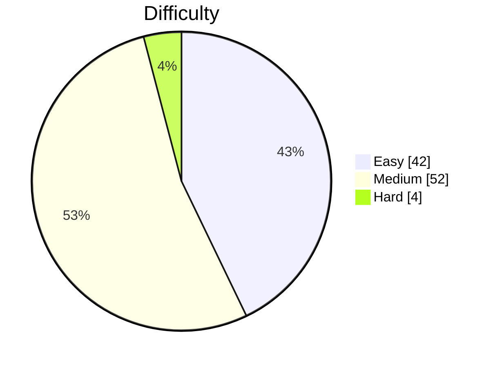

# LeetCode Solutions

LeetCode 풀이 모음입니다. [leetcode2remote](https://github.com/kevstevie/leetcode2remote) CLI로 자동 관리됩니다.

<!-- LEETCODE-STATS:START -->

## 📊 풀이 통계

**총 풀이: 98문제** · Easy 42 · Medium 52 · Hard 4

### 난이도별 분포

```mermaid
pie showData
    title Difficulty
    "Easy"   : 42
    "Medium" : 52
    "Hard"   : 4
```

### 토픽별 분포 (Top 10)

| # | 토픽 | 풀이 수 | 분포 |
| ---: | --- | ---: | :--- |
| 1 | Array | 46 | ████████████████████████ |
| 2 | String | 19 | ██████████ |
| 3 | Math | 17 | █████████ |
| 4 | Sorting | 17 | █████████ |
| 5 | Hash Table | 13 | ███████ |
| 6 | Two Pointers | 8 | ████ |
| 7 | Matrix | 7 | ████ |
| 8 | Simulation | 7 | ████ |
| 9 | Greedy | 6 | ███ |
| 10 | Counting | 4 | ██ |

<!-- LEETCODE-STATS:END -->
