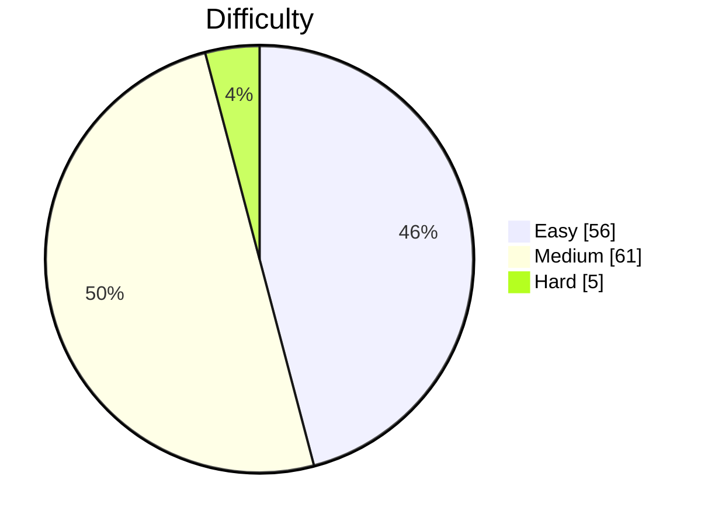

# LeetCode Solutions

LeetCode 풀이 모음입니다. [leetcode2remote](https://github.com/kevstevie/leetcode2remote) CLI로 자동 관리됩니다.

<!-- LEETCODE-STATS:START -->

## 📊 풀이 통계

**총 풀이: 122문제** · Easy 56 · Medium 61 · Hard 5

### 난이도별 분포

```mermaid
pie showData
    title Difficulty
    "Easy"   : 56
    "Medium" : 61
    "Hard"   : 5
```

### 토픽별 분포 (Top 10)

| # | 토픽 | 풀이 수 | 분포 |
| ---: | --- | ---: | :--- |
| 1 | Array | 57 | ████████████████████████ |
| 2 | Math | 25 | ███████████ |
| 3 | String | 24 | ██████████ |
| 4 | Hash Table | 22 | █████████ |
| 5 | Sorting | 22 | █████████ |
| 6 | Two Pointers | 9 | ████ |
| 7 | Greedy | 8 | ███ |
| 8 | Matrix | 7 | ███ |
| 9 | Simulation | 7 | ███ |
| 10 | Prefix Sum | 6 | ███ |

<!-- LEETCODE-STATS:END -->
