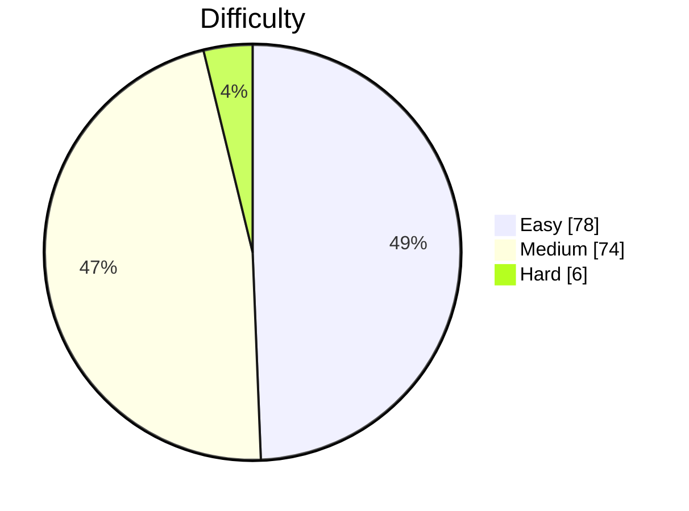

# LeetCode Solutions

LeetCode 풀이 모음입니다. [leetcode2remote](https://github.com/kevstevie/leetcode2remote) CLI로 자동 관리됩니다.

<!-- LEETCODE-STATS:START -->

## 📊 풀이 통계

**총 풀이: 158문제** · Easy 78 · Medium 74 · Hard 6

### 난이도별 분포

```mermaid
pie showData
    title Difficulty
    "Easy"   : 78
    "Medium" : 74
    "Hard"   : 6
```

### 토픽별 분포 (Top 10)

| # | 토픽 | 풀이 수 | 분포 |
| ---: | --- | ---: | :--- |
| 1 | Array | 75 | ████████████████████████ |
| 2 | String | 38 | ████████████ |
| 3 | Math | 30 | ██████████ |
| 4 | Hash Table | 27 | █████████ |
| 5 | Sorting | 27 | █████████ |
| 6 | Greedy | 14 | ████ |
| 7 | Stack | 12 | ████ |
| 8 | Two Pointers | 11 | ████ |
| 9 | Bracket Sequences | 10 | ███ |
| 10 | Simulation | 10 | ███ |

<!-- LEETCODE-STATS:END -->
